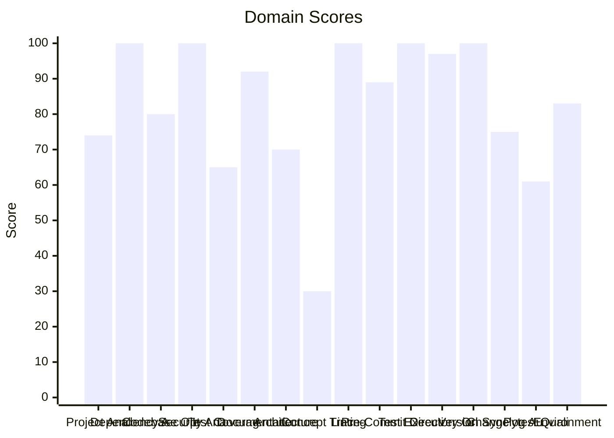

# 🔬 Code Enhancement Report

> **Generated**: 2026-05-22 21:23:17 UTC | **Target**: audio-transcriber | **Overall GPA**: 2.81/4.0

---

## 📊 Executive Summary

| Domain | Grade | Score | Status |
|--------|-------|-------|--------|
| Concept Traceability | 🔴 F | 30/100 | `██████░░░░░░░░░░░░░░` 30/100 |
| Pytest Quality | 🟠 D | 61/100 | `████████████░░░░░░░░` 61/100 |
| Test Coverage | 🟠 D | 65/100 | `█████████████░░░░░░░` 65/100 |
| Architecture & Design Patterns | 🟡 C | 70/100 | `██████████████░░░░░░` 70/100 |
| Project Analysis | 🟡 C | 74/100 | `██████████████░░░░░░` 74/100 |
| Changelog Audit | 🟡 C | 75/100 | `███████████████░░░░░` 75/100 |
| Codebase Optimization | 🔵 B | 80/100 | `████████████████░░░░` 80/100 |
| Environment Variables | 🔵 B | 83/100 | `████████████████░░░░` 83/100 |
| Pre-Commit Compliance | 🔵 B | 89/100 | `█████████████████░░░` 89/100 |
| Documentation & Governance | 🟢 A | 92/100 | `██████████████████░░` 92/100 |
| Directory Organization | 🟢 A | 97/100 | `███████████████████░` 97/100 |
| Dependency Audit | 🟢 A | 100/100 | `████████████████████` 100/100 |
| Security Analysis | 🟢 A | 100/100 | `████████████████████` 100/100 |
| Linting & Formatting | 🟢 A | 100/100 | `████████████████████` 100/100 |
| Test Execution | 🟢 A | 100/100 | `████████████████████` 100/100 |
| Version Sync Analysis | 🟢 A | 100/100 | `████████████████████` 100/100 |

---

## 📋 Domain Scorecards

### Project Analysis — 🟡 Grade: C (74/100)

`██████████████░░░░░░` 74/100

> [!NOTE]
> Detected ecosystem marker: agent-utilities → Agent-Utilities Ecosystem

| Criterion | Points | Evidence | Reasoning |
|-----------|--------|----------|-----------|
| has_pyproject | 10 | `pyproject.toml and requirements.txt` | Both pyproject.toml and requirements.txt exist, fulfilling mandatory Python proj |
| project_type_detected | 10 | `Agent-Utilities Ecosystem` | Identified 1 ecosystem marker(s) in dependencies |
| externalized_prompts | 0 | `/home/apps/workspace/agent-packages/agents/audio-transcriber` | No prompts/ directory found. Prompts may be hardcoded in source. |
| observability | 0 | `dependency list` | No observability tools (logfire, sentry, opentelemetry) found |
| testing_suite | 10 | `tests dir: True, pytest dep: True` | Tests directory exists, pytest in dependencies |
| agents_md | 10 | `/home/apps/workspace/agent-packages/agents/audio-transcriber` | AGENTS.md exists with comprehensive content |
| pre_commit_hooks | 10 | `/home/apps/workspace/agent-packages/agents/audio-transcriber` | Pre-commit configuration found for automated code quality checks |
| gitignore | 10 | `/home/apps/workspace/agent-packages/agents/audio-transcriber` | .gitignore exists to prevent committing build artifacts and secrets |
| env_template | 10 | `/home/apps/workspace/agent-packages/agents/audio-transcriber` | Environment template exists for onboarding and secret management |
| protocol_support | 4 | `MCP` | 1 communication protocol(s) detected |

**Findings:**
- Protocol support: MCP

---

### Dependency Audit — 🟢 Grade: A (100/100)

`████████████████████` 100/100

| Criterion | Points | Evidence | Reasoning |
|-----------|--------|----------|-----------|
| dependency_freshness | 100 | `source=/home/apps/workspace/agent-packages/agents/audio-tran` | Audited 11 deps (10 installed, 1 constraint-only). 0 major, 0 minor, 0 patch upd |

---

### Codebase Optimization — 🔵 Grade: B (80/100)

`████████████████░░░░` 80/100

> [!NOTE]
> Needs attention: audio_transcriber.py (763L) — 1 functions with high complexity (worst: AudioTranscriber.export at 24L, CC=6)

| Criterion | Points | Evidence | Reasoning |
|-----------|--------|----------|-----------|
| code_quality | 80 | `{"file_count": 17, "total_lines": 2897, "function_count": 12` | Analyzed 17 files, 125 functions. Avg CC=3.3, max length=193, duplication=0.9%,  |

**Findings:**
- 9 functions with nesting depth >4

---

### Security Analysis — 🟢 Grade: A (100/100)

`████████████████████` 100/100

| Criterion | Points | Evidence | Reasoning |
|-----------|--------|----------|-----------|
| security_posture | 100 | `high=0 med=0 low=0 attack_surface={"subprocess_calls": 0, "f` | Scanned 17 files. Found 0 security findings. High: -0pts, Med: -0pts, Low: -0pts |

---

### Test Coverage — 🟠 Grade: D (65/100)

`█████████████░░░░░░░` 65/100

> [!WARNING]
> 6 tests without assertions

| Criterion | Points | Evidence | Reasoning |
|-----------|--------|----------|-----------|
| test_coverage_quality | 65 | `{"test_file_count": 8, "test_count": 48, "source_file_count"` | 48 tests across 8 files. Ratio: 2.82. Intent: {'unit': 48}. 6 without assertions |

**Findings:**
- Test suite lacks intent diversity (only one type)
- 14 potential doc-test drift items

---

### Documentation & Governance — 🟢 Grade: A (92/100)

`██████████████████░░` 92/100

> [!TIP]
> README.md missing sections: usage|quick start

| Criterion | Points | Evidence | Reasoning |
|-----------|--------|----------|-----------|
| documentation_quality | 92 | `{"README.md": {"exists": true, "missing": ["usage|quick star` | Audited 6 standard docs + docs/ directory. 0 broken references, 4 docs present.  |

**Findings:**
- 2 broken internal links in README.md
- README missing: Has a Table of Contents
- README missing: Has usage examples with code blocks

---

### Architecture & Design Patterns — 🟡 Grade: C (70/100)

`██████████████░░░░░░` 70/100

> [!NOTE]
> SRP: 1 modules exceed 500 lines (god modules)

| Criterion | Points | Evidence | Reasoning |
|-----------|--------|----------|-----------|
| architecture_quality | 70 | `{"layers": 0, "di_ratio": 0.29, "solid_violations": 2}` | Analyzed 17 files. 0/5 architecture layers present, DI ratio: 29%, 2 SOLID viola |

**Findings:**
- SRP: 1 classes have >15 methods
- No discernible layer architecture (no domain/service/adapter separation)

---

### Concept Traceability — 🔴 Grade: F (30/100)

`██████░░░░░░░░░░░░░░` 30/100

> [!CAUTION]
> Low traceability ratio: 0% concepts fully traced

| Criterion | Points | Evidence | Reasoning |
|-----------|--------|----------|-----------|
| concept_traceability | 30 | `{"total_concepts": 5, "well_traced": 0, "orphans": 5, "drift` | 5 unique concepts found. 0 fully traced (code+docs+tests), 5 orphans, 0 drifted. |

**Findings:**
- 48 test functions missing concept markers
- 25 significant functions (>10 lines) missing concept markers in docstrings

---

### Linting & Formatting — 🟢 Grade: A (100/100)

`████████████████████` 100/100

> [!TIP]
> Total lint findings: 0 (high/error: 0, medium/warning: 0, low: 0)

| Criterion | Points | Evidence | Reasoning |
|-----------|--------|----------|-----------|
| lint_compliance | 100 | `ruff=0, bandit=0, mypy=0` | 0 total findings across 3 tools. High/error: -0pts, Med/warning: -0pts, Low: -0p |

---

### Pre-Commit Compliance — 🔵 Grade: B (89/100)

`█████████████████░░░` 89/100

> [!NOTE]
> 1/25 pre-commit hooks failed: mypy

| Criterion | Points | Evidence | Reasoning |
|-----------|--------|----------|-----------|
| precommit_compliance | 89 | `{"total_hooks": 25, "passed": 23, "failed": 1, "skipped": 1,` | Ran pre-commit with 25 hooks: 23 passed, 1 failed, 1 skipped. 2 potentially outd |

**Findings:**
- 2 hook(s) may be outdated: ruff-pre-commit, uv-pre-commit
- Pytest hooks skipped (handled by CE-016 Test Execution): pytest, local-pytest

---

### Test Execution — 🟢 Grade: A (100/100)

`████████████████████` 100/100

| Criterion | Points | Evidence | Reasoning |
|-----------|--------|----------|-----------|
| test_execution | 100 | `{"frameworks_detected": 1, "total_passed": 47, "total_failed` | Executed 1 framework(s). 47 passed, 0 failed, 0 errors. Pass rate: 100%. |

---

### Directory Organization — 🟢 Grade: A (97/100)

`███████████████████░` 97/100

> [!TIP]
> 1 rogue/throwaway scripts detected (fix_*, validate_*, patch_*, etc.): scripts/validate_a2a_agent.py

| Criterion | Points | Evidence | Reasoning |
|-----------|--------|----------|-----------|
| directory_organization | 97 | `{"total_source_files": 42, "total_directories": 8, "max_dept` | 42 files across 8 directories. Max depth: 3, avg files/dir: 5.2. 0 crowded, 0 se |

---

### Version Sync Analysis — 🟢 Grade: A (100/100)

`████████████████████` 100/100

> [!TIP]
> All version '0.18.0' declarations appear to be tracked correctly.

| Criterion | Points | Evidence | Reasoning |
|-----------|--------|----------|-----------|
| bumpversion_exists | 20 | `/home/apps/workspace/agent-packages/agents/audio-transcriber` | .bumpversion.cfg found |
| current_version_defined | 20 | `0.18.0` | Current version tracked is 0.18.0 |
| files_tracked | 20 | `6 files tracked` | Found 6 files tracked in .bumpversion.cfg |
| version_drift_check | 40 | `0 drifted files` | No version drift detected in codebase files |

---

### Changelog Audit — 🟡 Grade: C (75/100)

`███████████████░░░░░` 75/100

> [!NOTE]
> CHANGELOG.md is missing — create one following Keep a Changelog format

| Criterion | Points | Evidence | Reasoning |
|-----------|--------|----------|-----------|
| changelog_quality | 75 | `{"exists": false, "parseable": false, "version_count": 0, "h` | CHANGELOG.md missing. 0 versions tracked. 0 dependency changelogs analyzed. |

**Findings:**
- CHANGELOG.md is missing

---

### Pytest Quality — 🟠 Grade: D (61/100)

`████████████░░░░░░░░` 61/100

> [!WARNING]
> Test directory lacks subdirectory organization (consider unit/, integration/, e2e/)

| Criterion | Points | Evidence | Reasoning |
|-----------|--------|----------|-----------|
| pytest_quality | 61 | `{"test_files": 8, "total_tests": 48, "descriptive_name_ratio` | 48 tests across 8 files. Naming: 20/20, Structure: 15/20, Fixtures: 3/20, Assert |

**Findings:**
- Missing conftest.py for shared fixtures
- Low fixture usage: only 8% of tests use fixtures
- No @pytest.mark.parametrize usage — consider data-driven tests
- No shared fixtures in conftest.py

---

### Environment Variables — 🔵 Grade: B (83/100)

`████████████████░░░░` 83/100

> [!NOTE]
> Partial env var documentation: 57% coverage

| Criterion | Points | Evidence | Reasoning |
|-----------|--------|----------|-----------|
| env_var_documentation | 83 | `{"total_vars": 14, "python_vars": 2, "dockerfile_vars": 4, "` | Found 14 unique env vars across 34 occurrences. README documents 8/14. Has .env. |

**Findings:**
- Undocumented env vars: AUDIO_PROCESSINGTOOL, AUTH_TYPE, EUNOMIA_POLICY_FILE, EUNOMIA_TYPE, OTEL_EXPORTER_OTLP_ENDPOINT, WHISPER_MODEL
- 1 Python env vars not in .env.example: WHISPER_MODEL

---

## 🎯 Prioritized Action Items

| # | Priority | Domain | Action | Impact | Risk |
|---|----------|--------|--------|--------|------|
| 1 | 🔴 High | Concept Traceability | Low traceability ratio: 0% concepts fully traced | High | High |
| 2 | 🔴 High | Concept Traceability | 48 test functions missing concept markers | High | High |
| 3 | 🔴 High | Concept Traceability | 25 significant functions (>10 lines) missing concept markers in docstrings | High | High |
| 4 | 🔴 High | Test Coverage | 6 tests without assertions | High | Medium |
| 5 | 🔴 High | Test Coverage | Test suite lacks intent diversity (only one type) | High | Medium |
| 6 | 🔴 High | Test Coverage | 14 potential doc-test drift items | High | Medium |
| 7 | 🔴 High | Pytest Quality | Test directory lacks subdirectory organization (consider unit/, integration/, e2 | High | Medium |
| 8 | 🔴 High | Pytest Quality | Missing conftest.py for shared fixtures | High | Medium |
| 9 | 🔴 High | Pytest Quality | Low fixture usage: only 8% of tests use fixtures | High | Medium |
| 10 | 🔴 High | Pytest Quality | No @pytest.mark.parametrize usage — consider data-driven tests | High | Medium |
| 11 | 🔴 High | Pytest Quality | No shared fixtures in conftest.py | High | Medium |
| 12 | 🔴 High | Pytest Quality | 6 tests have no assertions | High | Medium |
| 13 | 🔴 High | Pytest Quality | 9 tests have excessive mocking (>5 mocks) — test behavior, not implementation | High | Medium |
| 14 | 🔴 High | Pytest Quality | 1 tests exceed 100 lines — likely doing too much per test | High | Medium |
| 15 | 🟡 Medium | Project Analysis | Detected ecosystem marker: agent-utilities → Agent-Utilities Ecosystem | Medium | Low |
| 16 | 🟡 Medium | Project Analysis | Protocol support: MCP | Medium | Low |
| 17 | 🟡 Medium | Architecture & Design Patterns | SRP: 1 modules exceed 500 lines (god modules) | Medium | Low |
| 18 | 🟡 Medium | Architecture & Design Patterns | SRP: 1 classes have >15 methods | Medium | Low |
| 19 | 🟡 Medium | Architecture & Design Patterns | No discernible layer architecture (no domain/service/adapter separation) | Medium | Low |
| 20 | 🟡 Medium | Changelog Audit | CHANGELOG.md is missing — create one following Keep a Changelog format | Medium | Low |
| 21 | 🟡 Medium | Changelog Audit | CHANGELOG.md is missing | Medium | Low |
| 22 | 🟢 Low | Codebase Optimization | Needs attention: audio_transcriber.py (763L) — 1 functions with high complexity  | Low | Low |
| 23 | 🟢 Low | Codebase Optimization | 9 functions with nesting depth >4 | Low | Low |
| 24 | 🟢 Low | Pre-Commit Compliance | 1/25 pre-commit hooks failed: mypy | Low | Low |
| 25 | 🟢 Low | Pre-Commit Compliance | 2 hook(s) may be outdated: ruff-pre-commit, uv-pre-commit | Low | Low |
| 26 | 🟢 Low | Pre-Commit Compliance | Pytest hooks skipped (handled by CE-016 Test Execution): pytest, local-pytest | Low | Low |
| 27 | 🟢 Low | Environment Variables | Partial env var documentation: 57% coverage | Low | Low |
| 28 | 🟢 Low | Environment Variables | Undocumented env vars: AUDIO_PROCESSINGTOOL, AUTH_TYPE, EUNOMIA_POLICY_FILE, EUN | Low | Low |
| 29 | 🟢 Low | Environment Variables | 1 Python env vars not in .env.example: WHISPER_MODEL | Low | Low |
| 30 | 🟢 Low | Documentation & Governance | README.md missing sections: usage|quick start | Low | Low |

---

## 🔄 SDD Handoff

Run `generate_sdd_handoff.py` with this report's JSON data to produce
structured TODO items compatible with the `spec-generator` → `task-planner` →
`sdd-implementer` pipeline. Output will be saved to `.specify/specs/`.
