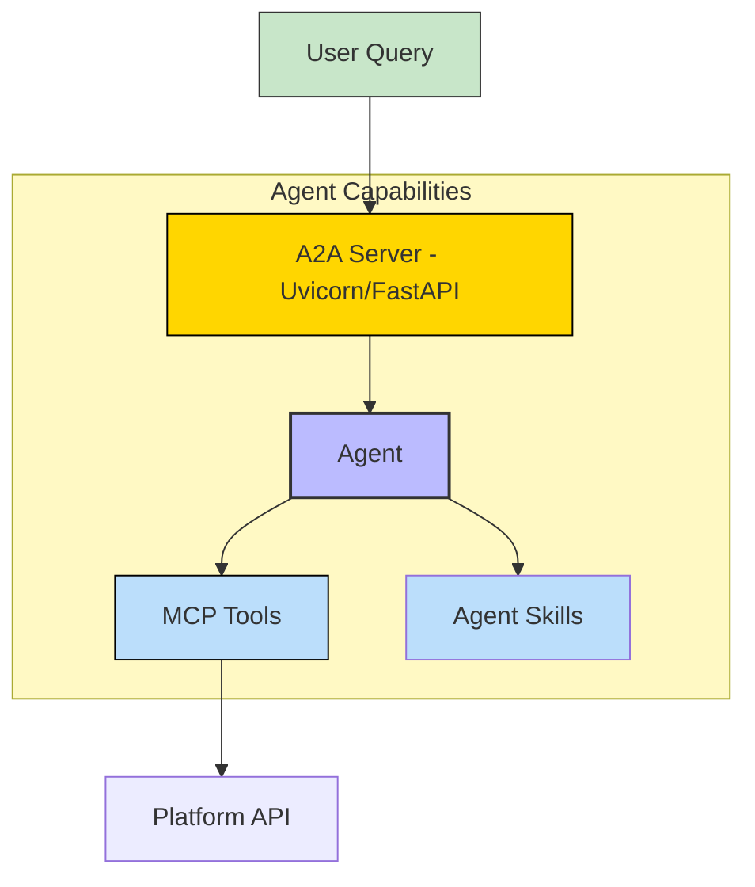
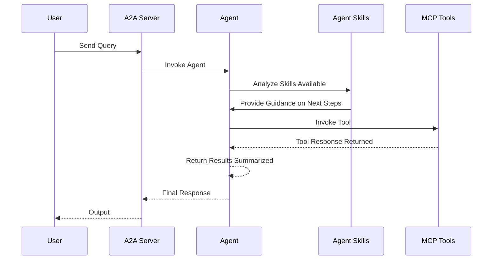

# Audio-Transcriber - A2A | AG-UI | MCP


*Version: 0.5.74*

## Overview

Transcribe your .wav .mp4 .mp3 .flac files to text or record your own audio!

This repository is actively maintained - Contributions are welcome!

Contribution Opportunities:
- Support new models

Wrapped around [OpenAI Whisper](https://pypi.org/project/openai-whisper)

## MCP

## MCP Tools

| Function Name      | Description                                                                 | Tag(s)             |
|:-------------------|:----------------------------------------------------------------------------|:-------------------|
| `transcribe_audio` | Transcribes audio from a provided file or by recording from the microphone. | `audio_processing` |

## A2A Agent

### Architecture Summary



### Component Interaction Diagram



## Usage

### CLI

| Short Flag | Long Flag        | Description                            |
|------------|------------------|----------------------------------------|
| -h         | --help           | See Usage                              |
| -b         | --bitrate   | Bitrate to use during recording                               |
| -c         | --channels  | Number of channels to use during recording                    |
| -d         | --directory | Directory to save recording                                   |
| -e         | --export    | Export txt, srt, and vtt files                                |
| -f         | --file      | File to transcribe                                            |
| -l         | --language  | Language to transcribe                                        |
| -m         | --model     | Model to use: <tiny, base, small, medium, large>              |
| -n         | --name      | Name of recording                                             |
| -r         | --record    | Specify number of seconds to record to record from microphone |


```bash
audio-transcriber --file '~/Downloads/Federal_Reserve.mp4' --model 'large'
```

```bash
audio-transcriber --record 60 --directory '~/Downloads/' --name 'my_recording.wav' --model 'tiny'
```

### MCP CLI

| Short Flag | Long Flag                          | Description                                                                 |
|------------|------------------------------------|-----------------------------------------------------------------------------|
| -h         | --help                             | Display help information                                                    |
| -t         | --transport                        | Transport method: 'stdio', 'http', or 'sse' [legacy] (default: stdio)       |
| -s         | --host                             | Host address for HTTP transport (default: 0.0.0.0)                          |
| -p         | --port                             | Port number for HTTP transport (default: 8000)                              |
|            | --auth-type                        | Authentication type: 'none', 'static', 'jwt', 'oauth-proxy', 'oidc-proxy', 'remote-oauth' (default: none) |
|            | --token-jwks-uri                   | JWKS URI for JWT verification                                              |
|            | --token-issuer                     | Issuer for JWT verification                                                |
|            | --token-audience                   | Audience for JWT verification                                              |
|            | --oauth-upstream-auth-endpoint     | Upstream authorization endpoint for OAuth Proxy                             |
|            | --oauth-upstream-token-endpoint    | Upstream token endpoint for OAuth Proxy                                    |
|            | --oauth-upstream-client-id         | Upstream client ID for OAuth Proxy                                         |
|            | --oauth-upstream-client-secret     | Upstream client secret for OAuth Proxy                                     |
|            | --oauth-base-url                   | Base URL for OAuth Proxy                                                   |
|            | --oidc-config-url                  | OIDC configuration URL                                                     |
|            | --oidc-client-id                   | OIDC client ID                                                             |
|            | --oidc-client-secret               | OIDC client secret                                                         |
|            | --oidc-base-url                    | Base URL for OIDC Proxy                                                    |
|            | --remote-auth-servers              | Comma-separated list of authorization servers for Remote OAuth             |
|            | --remote-base-url                  | Base URL for Remote OAuth                                                  |
|            | --allowed-client-redirect-uris     | Comma-separated list of allowed client redirect URIs                       |
|            | --eunomia-type                     | Eunomia authorization type: 'none', 'embedded', 'remote' (default: none)   |
|            | --eunomia-policy-file              | Policy file for embedded Eunomia (default: mcp_policies.json)              |
|            | --eunomia-remote-url               | URL for remote Eunomia server                                              |

### Using as an MCP Server

The MCP Server can be run in two modes: `stdio` (for local testing) or `http` (for networked access). To start the server, use the following commands:

#### Run in stdio mode (default):
```bash
audio-transcriber-mcp
```

#### Run in HTTP mode:
```bash
audio-transcriber-mcp --transport "http"  --host "0.0.0.0"  --port "8000"
```

#### Model Information

[Courtesy of and Credits to OpenAI: Whisper.ai](https://github.com/openai/whisper/blob/main/README.md)

|  Size  | Parameters | English-only model | Multilingual model | Required VRAM | Relative speed |
|:------:|:----------:|:------------------:|:------------------:|:-------------:|:--------------:|
|  tiny  |    39 M    |     `tiny.en`      |       `tiny`       |     ~1 GB     |      ~32x      |
|  base  |    74 M    |     `base.en`      |       `base`       |     ~1 GB     |      ~16x      |
| small  |   244 M    |     `small.en`     |      `small`       |     ~2 GB     |      ~6x       |
| medium |   769 M    |    `medium.en`     |      `medium`      |     ~5 GB     |      ~2x       |
| large  |   1550 M   |        N/A         |      `large`       |    ~10 GB     |       1x       |


### Deploy MCP Server as a Service

The ServiceNow MCP server can be deployed using Docker, with configurable authentication, middleware, and Eunomia authorization.

#### Using Docker Run

```bash
docker pull knucklessg1/audio-transcriber:latest

docker run -d \
  --name audio-transcriber-mcp \
  -p 8004:8004 \
  -e HOST=0.0.0.0 \
  -e PORT=8004 \
  -e TRANSPORT=http \
  -e AUTH_TYPE=none \
  -e EUNOMIA_TYPE=none \
  knucklessg1/audio-transcriber:latest
```

For advanced authentication (e.g., JWT, OAuth Proxy, OIDC Proxy, Remote OAuth) or Eunomia, add the relevant environment variables:

```bash
docker run -d \
  --name audio-transcriber-mcp \
  -p 8004:8004 \
  -e HOST=0.0.0.0 \
  -e PORT=8004 \
  -e TRANSPORT=http \
  -e AUTH_TYPE=oidc-proxy \
  -e OIDC_CONFIG_URL=https://provider.com/.well-known/openid-configuration \
  -e OIDC_CLIENT_ID=your-client-id \
  -e OIDC_CLIENT_SECRET=your-client-secret \
  -e OIDC_BASE_URL=https://your-server.com \
  -e ALLOWED_CLIENT_REDIRECT_URIS=http://localhost:*,https://*.example.com/* \
  -e EUNOMIA_TYPE=embedded \
  -e EUNOMIA_POLICY_FILE=/app/mcp_policies.json \
  knucklessg1/audio-transcriber:latest
```

#### Using Docker Compose

Create a `docker-compose.yml` file:

```yaml
services:
  audio-transcriber-mcp:
    image: knucklessg1/audio-transcriber:latest
    environment:
      - HOST=0.0.0.0
      - PORT=8004
      - TRANSPORT=http
      - AUTH_TYPE=none
      - EUNOMIA_TYPE=none
    ports:
      - 8004:8004
```

For advanced setups with authentication and Eunomia:

```yaml
services:
  audio-transcriber-mcp:
    image: knucklessg1/audio-transcriber:latest
    environment:
      - HOST=0.0.0.0
      - PORT=8004
      - TRANSPORT=http
      - AUTH_TYPE=oidc-proxy
      - OIDC_CONFIG_URL=https://provider.com/.well-known/openid-configuration
      - OIDC_CLIENT_ID=your-client-id
      - OIDC_CLIENT_SECRET=your-client-secret
      - OIDC_BASE_URL=https://your-server.com
      - ALLOWED_CLIENT_REDIRECT_URIS=http://localhost:*,https://*.example.com/*
      - EUNOMIA_TYPE=embedded
      - EUNOMIA_POLICY_FILE=/app/mcp_policies.json
    ports:
      - 8004:8004
    volumes:
      - ./mcp_policies.json:/app/mcp_policies.json
```

Run the service:

```bash
docker-compose up -d
```

#### Configure `mcp.json` for AI Integration

Configure `mcp.json`
```json
{
  "mcpServers": {
    "audio_transcriber": {
      "command": "uv",
      "args": [
        "run",
        "--with",
        "audio-transcriber",
        "audio-transcriber-mcp"
      ],
      "env": {
        "WHISPER_MODEL": "medium",            // Optional
        "TRANSCRIBE_DIRECTORY": "~/Downloads" // Optional
      },
      "timeout": 200000
    }
  }
}
```
### A2A CLI
#### Endpoints
- **Web UI**: `http://localhost:8000/` (if enabled)
- **A2A**: `http://localhost:8000/a2a` (Discovery: `/a2a/.well-known/agent.json`)
- **AG-UI**: `http://localhost:8000/ag-ui` (POST)

| Short Flag | Long Flag         | Description                                                            |
|------------|-------------------|------------------------------------------------------------------------|
| -h         | --help            | Display help information                                               |
|            | --host            | Host to bind the server to (default: 0.0.0.0)                          |
|            | --port            | Port to bind the server to (default: 9000)                             |
|            | --reload          | Enable auto-reload                                                     |
|            | --provider        | LLM Provider: 'openai', 'anthropic', 'google', 'huggingface'           |
|            | --model-id        | LLM Model ID (default: qwen3:4b)                                       |
|            | --base-url        | LLM Base URL (for OpenAI compatible providers)                         |
|            | --api-key         | LLM API Key                                                            |

|            | --mcp-url         | MCP Server URL (default: http://localhost:8000/mcp)                    |
|            | --web             | Enable Pydantic AI Web UI                                              | False (Env: ENABLE_WEB_UI) |


## Install Python Package

```bash
python -m pip install audio-transcriber
```

or

```bash
uv pip install --upgrade audio-transcriber
```

##### Ubuntu Dependencies
```bash
sudo apt-get update
sudo apt-get install libasound-dev portaudio19-dev libportaudio2 libportaudiocpp0 ffmpeg gcc -y
```


## Repository Owners


</details>
